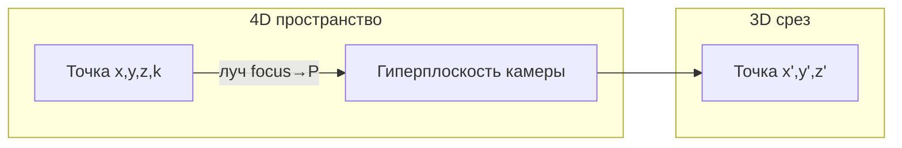

# engine — 3D/4D физический движок на OpenGL

Пет-проект для собственного удовольствия: сцены, физика, коллизии, превью в редакторе и просмотр в реальном времени. Проект развивался из школьной заготовки с применением **Cursor**, частично **DeepSeek**, и логики 4D от **Jackson Hall** ([4D-Graphics-Engine](https://github.com/jacksonthall22/4D-Graphics-Engine)).

## Назначение

Игровой/визуальный «песочник»: кубы, сферы, тор, цилиндры, пирамиды, тонкие плиты, **4D-каркасы** (тессеракт, гиперсфера), гравитация, столкновения, отладка границ и траекторий.

## Стек

| Компонент | Технология |
|-----------|------------|
| Ядро | C++17 (фактически C++14+), STL |
| Графика | OpenGL 1.x, GLUT, GLU |
| Сборка inner | Makefile |
| Сборка outer (редактор) | CMake, Qt5 |
| Физика | Собственная, substeps, сферы / треугольники |
| 4D | Встроенная проекция 4D→3D (`fourd_math`) |

## Почётные упоминания

- **Cursor** — основная среда разработки и AI-ассистент.
- **DeepSeek** — отдельные подсказки по коду в ранних итерациях.
- **Jackson Hall (jacksonthall22)** — математика и архитектура 4D-камеры/проекции ([4D-Graphics-Engine](https://github.com/jacksonthall22/4D-Graphics-Engine)); адаптировано под Linux и встроено в движок.
- Школьный проект — исходная точка (простые фигуры и GLUT).

## Целевое железо (эталон разработки)

| Параметр | Значение |
|----------|----------|
| CPU | Intel Core i5-6300HQ @ 2.30 GHz (4 ядра) |
| RAM | 8 GB |
| GPU | Intel встроенная, OpenGL через Mesa |

Ориентир: **слабый ноутбук / интегрированная графика**, 30–60 FPS на сценах до ~20 объектов без --O1 LOD.

## Структура

```
  inner/          — scene_viewer, физика, коллизии, сцены
  outer/          — scene_editor (Qt)
  textures/       — текстуры (water.png и др.)
  4d_logic_for_windows/ — исходный 4D-референс (отдельная сборка)
```

## Сборка и запуск

```bash
# Просмотрщик
cd inner && make scene_viewer
./scene_viewer --collision-test         # default_collision_test.scene
./scene_viewer -scene default_vect.scene
./scene_viewer -scene stress_test.scene
./scene_viewer -scene path/to.scene
./scene_viewer --no-info                # без HUD (FPS, камера)
./scene_viewer --O1                     # LOD коллизий по дистанции
./scene_viewer -sync 60                 # лимит FPS

# Редактор
cd outer/build && cmake .. && make
./scene_editor

# Тесты коллизий (все должны пройти)
cd inner && make test
# или
cd inner/tests/collision && make test
```

## Управление (scene_viewer)

| Клавиша | Действие |
|---------|----------|
| WASD, Space / 2 | Движение камеры |
| Q / E | Рыскание (3D) / сдвиг по оси **K** (4D-камера) |
| 5 / 0 | Тангаж |
| P | Пауза физики |
| ; | Слой отладки: выкл → границы → COM/скорость/траектория 5 с |
| T | Переключение камеры **3D / 4D** |
| + / − | Скорость времени 0.2× … 3.0× |
| LMB / RMB | Вращение / панорама |

В **редакторе**: выбор **3D-объекта** → камера 3D; выбор **4D-объекта** → камера 4D и ось **K** (фиолетовая).

## Принципы математики

### 3D коллизии

- **Сфера** — быстрый аналитический контакт.
- **Треугольный меш** — для кубов, плит, тора, крупных тел; тонкие плиты — только **верхняя грань**.
- **Меш vs меш** — контакт вершина–треугольник (`triangleTriangleContact`) с фильтром дальности; без ложных «притяжений» от далёких граней.
- **Alpha 0…1** — прозрачность; **1…2** — сила отражения (2 = зеркало).

### 4D

- Точка: **(x, y, z, k)**; k — четвёртая ось.
- **Проекция 4D→3D**: линия focus→точка пересекает гиперплоскость камеры; результат — 3D-координата на «срезе» (аналог Camera4D из референса).
- **Коллизия 4D**: гиперсферы в 4D; для движка также **срез в 3D** — «4D тела сталкиваются через 3D, как 3D через 2D».



### Тор (границы)

`glutSolidTorus(tube, major)`: кольцо в плоскости **XY**, трубка по **Z**. Меш коллизий совпадает с этой параметризацией и полным `scale`.

## Сцены

| Файл | Назначение |
|------|------------|
| `inner/default_collision_test.scene` | Все базовые фигуры на плите 100×100×0.1 |
| `inner/default_vect.scene` | Векторная демо-сцена (сфера, тонкий box, snowman) |
| `inner/stress_test.scene` | Нагрузочная сцена (тор, длинный куб, сфера) |

## Тесты

`inner/tests/collision/`:

1. **collision_suite** — падение на плиту, все фигуры, несколько высот.
2. **pair_suite** — пары без гравитации (cube+cube, torus+long_cube, sphere+sphere).
3. **fourd_suite** — 4D-сферы, проекция, тессеракт.
4. **stress_suite** — 60 с симуляции сцен и 2–5 тел.
5. **k_axis_suite** — K-слой: изоляция 3D, коллизии 4D, удар по K.

```bash
cd inner/tests/collision && make test
```

## Лицензии и код 4D

Код в `4d_logic_for_windows/` — © Jackson Hall; интегрированная упрощённая версия — в `inner/source/fourd_*.cpp`.
