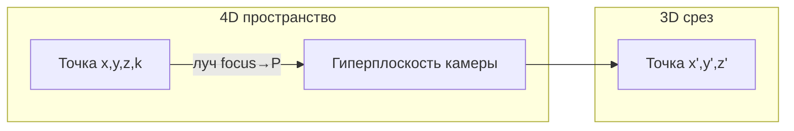

# engine — 3D физический движок на OpenGL

Пет-проект: сцены, физика, коллизии, превью в редакторе и просмотр в реальном времени. Развивался из школьной заготовки с **Cursor**, частично **DeepSeek**. В ядре остаётся 4D-математика от **Jackson Hall** ([4D-Graphics-Engine](https://github.com/jacksonthall22/4D-Graphics-Engine)); **в редакторе 4D сейчас скрыт** (старые `.scene` с тессерактами по-прежнему открываются).

## Назначение

Игровой/визуальный «песочник»: кубы, сферы, тор, цилиндры, пирамиды, произвольный `mesh`, гравитация, столкновения, C++-скрипты (`.so`), отладка границ и траекторий. Камера сцены — обычный объект иерархии; в превью — стрелки переноса и кольца поворота.

## Стек

| Компонент | Технология |
|-----------|------------|
| Ядро | C++17 (фактически C++14+), STL |
| Графика | OpenGL 1.x, GLUT, GLU |
| Сборка inner | Makefile |
| Сборка outer (редактор) | CMake, Qt5 |
| Физика | Собственная, substeps, сферы / треугольники |
| 4D (ядро) | Проекция 4D→3D (`fourd_math`); UI редактора отключён |

## Почётные упоминания

- **Cursor** — основная среда разработки и AI-ассистент.
- **DeepSeek** — отдельные подсказки по коду в ранних итерациях.
- **Jackson Hall (jacksonthall22)** — математика и архитектура 4D-камеры/проекции ([4D-Graphics-Engine](https://github.com/jacksonthall22/4D-Graphics-Engine)); адаптировано под Linux и встроено в движок.
- Школьный проект — исходная точка (простые фигуры и GLUT).

## Целевое железо (эталон разработки)

| Параметр | Значение |
|----------|----------|
| CPU | Intel Core i5-6300HQ @ 2.30 GHz (4 ядра) |
| RAM | 8 GB |
| GPU | Intel встроенная, OpenGL через Mesa |

Ориентир: **слабый ноутбук / интегрированная графика**, 30–60 FPS на сценах до ~20 объектов. Качество масштабируется флагом `--power 1..10` (2 — профиль этой машины).

## Структура

```
  inner/          — scene_viewer, физика, коллизии, сцены, скрипты
  outer/          — scene_editor (Qt)
  textures/       — текстуры (water.png и др.)
  4d_logic_for_windows/ — исходный 4D-референс (отдельная сборка)
```

## Сборка и запуск

```bash
# Просмотрщик
cd inner && make scene_viewer
./scene_viewer --collision-test         # default_collision_test.scene
./scene_viewer -scene default.scene
./scene_viewer -scene default_vect.scene
./scene_viewer -scene stress_test.scene
./scene_viewer --no-info                # без HUD (FPS, камера)
./scene_viewer --O1                     # LOD коллизий по дистанции
./scene_viewer -sync 60                 # лимит FPS
./scene_viewer --power 2                # 1 = дешевле, 10 = тяжёлая машина

# Редактор
cd outer && cmake . && make
./scene_editor
./scene_editor --power 5

# Скрипты объектов
make -C inner/scripts

# Тесты коллизий (все должны пройти)
cd inner && make test
```

## Управление

### scene_viewer

| Клавиша | Действие |
|---------|----------|
| WASD, Space / 2 | Движение камеры |
| Q / E | Рыскание |
| 5 / 0 | Тангаж |
| P | Пауза физики |
| ; | Слой отладки: выкл → границы → COM/скорость/траектория 5 с |
| + / − | Скорость времени 0.2× … 3.0× |
| LMB / RMB | Вращение / панорама |

Клавиши **T** (камера 3D/4D) и сдвиг по **K** остаются в ядре для старых 4D-сцен.

### scene_editor

Раскладка как в Unity: **Hierarchy | Scene | Inspector**. Меню: **File | GameObject | View | Settings**.

| Элемент | Действие |
|---------|----------|
| Play / Pause / Stop | Физика в превью (`Scene::stepPhysics`) |
| View → overlays | Те же слои, что `;` во viewer (в том числе во время Play) |
| Settings | Язык EN/RU, тема тёмная/светлая |
| Transform → Opacity | Слайдер **0.00–1.00**, шаг 0.01 |
| Камера в иерархии | Точка взгляда, RX/RY = pitch/yaw, extra = дистанция |
| Стрелки RGB | Перенос выбранного объекта по осям |
| Кольца RGB | Поворот вокруг осей (пока тянете гизмо, орбита камеры не крутится) |
| Power 1..10 | Масштаб качества машины |

4D-фигуры, вкладка «4D Transform» и слайсер K в редакторе **скрыты**. Движок по-прежнему читает `tesseract` / `hypersphere` / `pyramid4d` / `16cell` из файла.

### Гравитация (инспектор Rigidbody)

| Режим | Поведение |
|-------|-----------|
| **Off** | Нет силы тяжести; объект остаётся на месте (кроме столкновений) |
| **Primitive** | Постоянный вектор ускорения (обычно `gy = -9.81`) |
| **Advanced** | Притяжение к точке или к центру другого объекта **на том же K-срезе** |

## Принципы математики

### 3D коллизии

- **Сфера** — быстрый аналитический контакт.
- **Треугольный меш** — для кубов, плит, тора, `mesh`, крупных тел; тонкие плиты — только **верхняя грань**.
- **Меш vs меш** — контакт вершина–треугольник с фильтром дальности.
- **Alpha 0…1** — непрозрачность (слайдер в Transform). В PHYS значения `1…2` по-прежнему читаются как отражение (зеркало при `2`).

### K-слой

Точка в ядре: **(x, y, z, k)**. **3D-тело занимает одну плоскость K** (нулевая толщина): два 3D-объекта взаимодействуют только при одинаковом `kPos`. Даже соседние слои (`0` и `0.1`) не сталкиваются и не притягиваются. 4D-тело имеет толщину вдоль K равную `hyperRadius`. Swept-sphere и аттракторы тоже пропускают пары с разных срезов.

4D-проекция и тетраэдрический срез политопов остаются в `fourd_math` / `fourd_figure` для совместимости файлов; в редакторе этим не пользуются.


```mermaid
flowchart LR
  subgraph fourD [4D пространство]
    P[Точка x,y,z,k]
    H[Гиперплоскость камеры]
  end
  subgraph threeD [3D срез]
    Q[Точка x',y',z']
  end
  P -->|луч focus→P| H
  H --> Q
```

### Тор (границы)

`glutSolidTorus(tube, major)`: кольцо в плоскости **XY**, трубка по **Z**. Меш коллизий совпадает с этой параметризацией и полным `scale`.

## Сцены

| Файл | Назначение |
|------|------------|
| `inner/default.scene` | Сцена по умолчанию редактора |
| `inner/default_collision_test.scene` | Все базовые фигуры на плите 100×100×0.1 |
| `inner/default_vect.scene` | Векторная демо-сцена (сфера, тонкий box, snowman) |
| `inner/stress_test.scene` | Нагрузочная сцена (тор, длинный куб, сфера) |

При открытии в редакторе, если в файле нет объекта `camera`, он добавляется в иерархию (позиция = точка взгляда).

## Тесты

`inner/tests/collision/` — восемь наборов:

1. **collision_suite** — падение на плиту, все фигуры, несколько высот.
2. **pair_suite** — пары без гравитации (cube+cube, torus+long_cube, sphere+sphere).
3. **fourd_suite** — 4D-сферы, проекция, тессеракт, tet-срез.
4. **stress_suite** — 60 с симуляции сцен и 2–5 тел.
5. **k_axis_suite** — изоляция 3D по K (в том числе соседние слои), коллизии 4D, удар по K.
6. **impulse_suite** — импульсы, отскок, гравитация off.
7. **subdiv_suite** — слайдер сетки и static body.
8. **unity_suite** — mesh/extrude/script.

```bash
cd inner/tests/collision && make test
```

Порядок: `collision_suite` → `pair_suite` → `fourd_suite` → `stress_suite` → `k_axis_suite` → `impulse_suite` → `subdiv_suite` → `unity_suite`.

## Лицензии и код 4D

Код в `4d_logic_for_windows/` — © Jackson Hall; интегрированная упрощённая версия — в `inner/source/fourd_*.cpp`.
