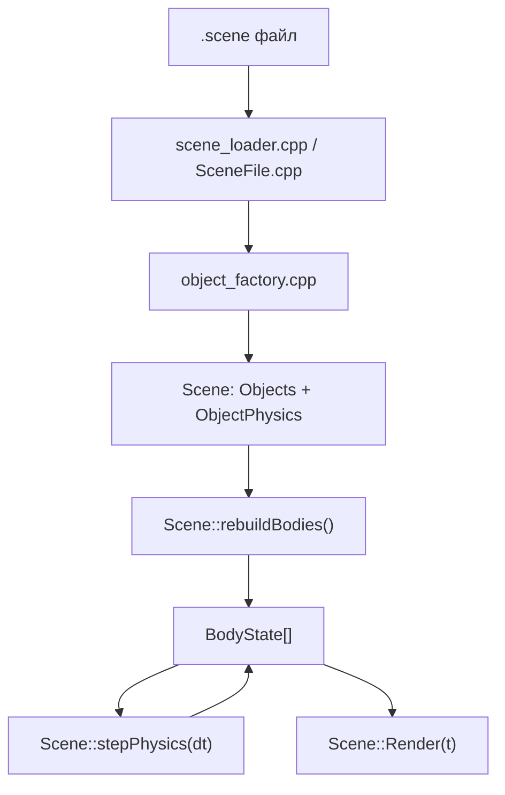
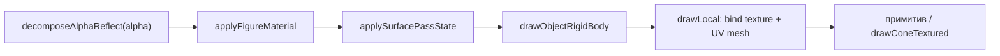
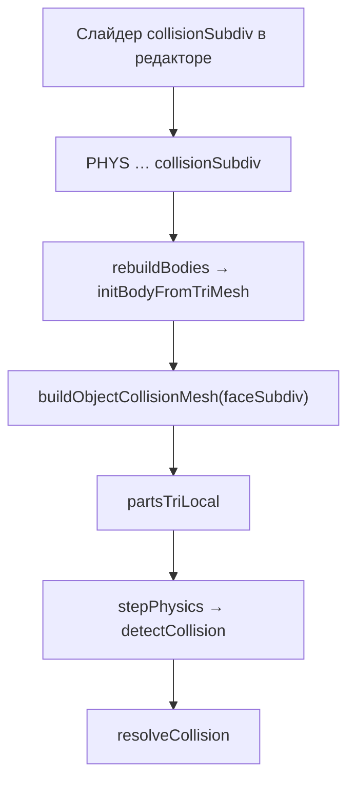

# TUTORIAL — физико-математико-программное пособие по движку `engine`

Полный разбор исходников проекта: от векторной алгебры до столкновений, текстур, скриптов и автотестов. 4D-проекция описана как часть ядра (совместимость файлов), не как текущий UI редактора.  
Аудитория: **от начинающего** (что за файл и зачем) **до опытного** (формулы импульсов, эвристики LOD, структура тестов).

---

## Оглавление

1. [Введение и карта репозитория](#1-введение-и-карта-репозитория)
2. [Стек технологий и поток данных](#2-стек-технологий-и-поток-данных)
3. [Глава I. Векторы и базовая математика](#3-глава-i-векторы-и-базовая-математика)
4. [Глава II. Фигуры, рендер и окружение](#4-глава-ii-фигуры-рендер-и-окружение)
5. [Глава III. Текстуры, материалы и отражения](#5-глава-iii-текстуры-материалы-и-отражения)
6. [Глава IV. Коллизии — меши, контакты, разбиения](#6-глава-iv-коллизии--меши-контакты-разбиения)
7. [Глава V. Физика — интеграция, импульсы, группы](#7-глава-v-физика--интеграция-импульсы-группы)
8. [Глава VI. Сцена, загрузчик и главный цикл](#8-глава-vi-сцена-загрузчик-и-главный-цикл)
9. [Глава VII. Четырёхмерная геометрия](#9-глава-vii-четырёхмерная-геометрия)
10. [Глава VIII. Редактор сцен (outer)](#10-глава-viii-редактор-сцен-outer)
11. [Глава IX. Автотесты коллизий](#11-глава-ix-автотесты-коллизий)
12. [Глава X. Референс `4d_logic_for_windows`](#12-глава-x-референс-4d_logic_for_windows)
13. [Формат файла `.scene`](#13-формат-файла-scene)
14. [Сборка, запуск, отладка](#14-сборка-запуск-отладка)
15. [Справочник: каждый `.h` / `.cpp` файл](#15-справочник-каждый-h--cpp-файл)
16. [Unity-подобный цикл на слабых машинах](#16-unity-подобный-цикл-на-слабых-машинах)

---

## 1. Введение и карта репозитория

Проект — **3D физический песочник** на OpenGL 1.x: объекты падают, сталкиваются, вращаются; есть редактор с превью и просмотрщик. 4D-математика остаётся в ядре для старых файлов; **UI редактора 4D сейчас скрыт**.

```
driver_test/
├── inner/                 # Ядро: scene_viewer, физика, коллизии
│   ├── headers/           # Заголовки (.h)
│   ├── source/            # Реализации (.cpp)
│   ├── tests/collision/   # 8 автотестовых бинарников
│   ├── scripts/           # примеры .so (orbit, linear_spin)
│   ├── *.scene            # Сцены
│   └── textures/          # (или ../textures/)
├── outer/                 # Qt-редактор scene_editor
│   ├── headers/
│   └── source/
├── textures/              # Общая папка текстур
└── 4d_logic_for_windows/  # Исходный 4D-референс Jackson Hall (отдельная сборка)
```

**Два исполняемых файла:**

| Программа | Путь | Назначение |
|-----------|------|------------|
| `scene_viewer` | `inner/scene_viewer` | Просмотр + физика + HUD |
| `scene_editor` | `outer/scene_editor` | Редактирование `.scene`, превью, Play |

**Не документируем подробно** (служебные / сторонние):

- `outer/scene_editor_autogen/` — автогенерация Qt MOC
- `inner/stb/stb_image.h` — библиотека загрузки изображений (Sean Barrett)
- `outer/build/`, объектные `.o` — артефакты сборки

---

## 2. Стек технологий и поток данных

### 2.1. Стек

| Слой | Технология |
|------|------------|
| Язык | C++17 (совместимо с C++14+) |
| Графика | OpenGL 1.x fixed pipeline, GLUT, GLU |
| Сборка inner | Makefile |
| Сборка outer | CMake + Qt5 (`QOpenGLWidget`) |
| Физика | Собственная: semi-implicit Euler, substeps от `--power` |
| Коллизии | Сферы + аналитика (box/cyl/torus) + треугольные меши |
| 4D (ядро) | `fourd_math`: проекция 4D→3D, K-плоскость; UI редактора скрыт |

### 2.2. Поток данных (от файла до кадра)


```mermaid
flowchart TB
    SCENE[".scene файл"]
    LOADER["scene_loader.cpp / SceneFile.cpp"]
    FACTORY["object_factory.cpp"]
    SCENE_OBJ["Scene: Objects + ObjectPhysics"]
    REBUILD["Scene::rebuildBodies()"]
    BODIES["BodyState[]"]
    STEP["Scene::stepPhysics(dt)"]
    RENDER["Scene::Render(t)"]

    SCENE --> LOADER --> FACTORY --> SCENE_OBJ
    SCENE_OBJ --> REBUILD --> BODIES
    BODIES --> STEP --> BODIES
    BODIES --> RENDER
```

**На каждом кадре:**

1. `animation::Display` обновляет LOD (`render_settings`) и вызывает `Scene::Render(t)`.
2. `Render` интегрирует физику (`stepPhysics`), рисует небо/пол/объекты.
3. Текстуры перепривязываются через `ensureSceneTexturesLoaded()` при первом GL-контексте.

---

## 3. Глава I. Векторы и базовая математика

### 3.1. Файл `inner/headers/vector.h`

Единственный «чистый» математический заголовок. Шаблон `vec<Type, N>` хранит **три** компоненты `x, y, z` (параметр `N` исторический, не используется).

#### Операции

| Метод / оператор | Формула |
|------------------|---------|
| `len2()` | \(\|v\|^2 = x^2 + y^2 + z^2\) |
| `len()` | \(\|v\| = \sqrt{\|v\|^2}\) |
| `dot(v)` | \(v \cdot w = x w_x + y w_y + z w_z\) |
| `operator^` (cross) | \(a \times b = (a_y b_z - a_z b_y,\; a_z b_x - a_x b_z,\; a_x b_y - a_y b_x)\) |
| `operator!` | Нормализация: \(v / \|v\|\), нулевой вектор при \(\|v\|=0\) |
| `operator*` / `/` | Покомпонентное умножение/деление на скаляр |

#### Иллюстрация: скалярное и векторное произведение

```
        z
        |   w
        |  /
        | /
        +-------- y
       /
      /
     x

dot(a,b) = |a| |b| cos(θ)     — проекция a на b
a × b    ⟂ плоскости (a,b)   — нормаль к плоскости
```

#### Вспомогательные функции

- `sign(A)` — знак числа (−1 или +1).
- `vec::Rnd()`, `RndCol()` — случайные точки/цвета (для демо-структур в `templates.h`).

**Зависимости:** только STL + `<cmath>`. Все остальные модули строятся на `vec<>`.

### 3.2. Матрицы 4×4 и frustum culling (`scene.h`)

OpenGL fixed pipeline хранит матрицы в **column-major** порядке (16 `double` в массиве `mat[16]`).

#### Умножение точки на матрицу вида/проекции

`transformPoint(p, mat)`:

\[
\begin{pmatrix} x' \\ y' \\ z' \end{pmatrix}
=
\begin{pmatrix}
m_0 & m_4 & m_8  & m_{12} \\
m_1 & m_5 & m_9  & m_{13} \\
m_2 & m_6 & m_{10} & m_{14}
\end{pmatrix}
\begin{pmatrix} x \\ y \\ z \\ 1 \end{pmatrix}
\]

(В коде индексация column-major: столбец `j` → `mat[j*4 + i]`.)

#### Умножение матриц

`multiplyMatrices(a, b, out)` — классическое \(4\times4\) произведение для построения `viewProj = P · V`.

#### Frustum: 6 плоскостей от проекции

`extractFrustumPlanesFromProj(planes, proj)` вытаскивает левую/правую/верхнюю/нижнюю/ближнюю/дальнюю плоскости из комбинированной матрицы.

`sphereInFrustum(planes, center, radius)` — для каждой плоскости проверяется

\[
n \cdot c + d \ge -r
\]

Если сфера bounding-объекта целиком с одной стороны хотя бы одной плоскости — объект **не рисуется** (early cull).

```
        far plane
           ___
          /   \
   left /     \ right
        |  cam  |
         \     /
          \___/
        near plane

Сфера (center, radius) должна пересекать все 6 полупространств «внутри» пирамиды.
```

Это единственное место в ядре с полноценными матрицами; повороты тел и камеры в остальном коде — **векторы + Rodrigues / glRotated**, без накопления матриц на CPU.

---

## 4. Глава II. Фигуры, рендер и окружение

### 4.1. `inner/headers/figures.h` + `inner/source/figures.cpp`

#### Базовый класс `based`

Абстрактная «рисуемая сущность»:

| Поле | Смысл |
|------|--------|
| `renderAlpha` | Только непрозрачность `[0,1]` после `decomposeAlphaReflect` |
| `reflectAmount` | Сила отражения `[0,1]` (из `alpha > 1` в PHYS) |
| `textureID` | OpenGL id текстуры (0 = только цвет) |
| `texRepeat` | Сколько раз картинка укладывается по осям (`autoTexRepeat`) |

**Виртуальные методы:**

- `Draw(double t)` — полная отрисовка с позицией объекта.
- `getBoundingSpheres(...)` — сферы для грубых границ и пикинга.
- `emergency_bounding_sphere_calc_protocol()` — запасной радиус.

#### Примитивы `Solid*`

Локальные примитивы в начале координат (без явного `pos`):

| Класс | Параметры | Отрисовка |
|-------|-----------|-----------|
| `SolidSphere` | `radius` | `gluSphere` (с UV) / `glutSolidSphere` |
| `SolidCube` | `hx,hy,hz` | `drawUnitCubeTextured` (6 граней, UV, CCW) |
| `SolidCylinder` | `radius`, `height` | `gluCylinder`, центр по Y |
| `SolidCone` | `radius`, `height` | `drawConeTextured` — **те же треугольники**, что у коллизии |
| `SolidPyramid` | `base`, `height` | `drawPyramidTextured`, центр как у коллизии |
| `SolidTorus` | `innerR`, `outerR` | `drawTorusTextured` (UV; у GLUT их нет) |

`glutSolidCube` / `glutSolidTorus` **не выдают** `glTexCoord` — без своих мешей текстура схлопывалась в один тексель. Обход граней — против часовой снаружи, иначе `GL_CULL_FACE` съедает 4 из 6 сторон.

`figures.cpp` только **определяет статические** `GLUquadric*` для конуса/цилиндра/сферы.

#### Окружение

**`GroundPlane`** — горизонтальная плоскость Y=0:

- Текстурированный квад с UV 0…1.
- `setReflect(amount, isWater)` — зеркальность для воды.

**`SkySphere`** — большая сфера «изнутри» с текстурой неба.

#### Namespace `physmath` — объёмы (для оценки массы)

\[
V_{\text{sphere}} = \tfrac{4}{3}\pi r^3,\quad
V_{\text{box}} = 2h_x \cdot 2h_y \cdot 2h_z,\quad
V_{\text{cyl}} = \pi r^2 h,\quad
V_{\text{cone}} = \tfrac{1}{3}\pi r^2 h
\]

#### Вспомогательные повороты

`rotateX/Y/Z(angle_rad)` — матрицы Эйлера вокруг одной оси (используются в bounding sphere merge).

`mergeSpheres(a, ra, b, rb)` — минимальная сфера, покрывающая две сферы (центр на линии между центрами).

---

### 4.2. `inner/headers/manual_shapes.h` + `inner/source/manual_shapes.cpp`

**Редакторские примитивы** с явной трансформацией:

| Класс | Поля |
|-------|------|
| `EditorSphere` | `pos`, `scale`, `rx,ry,rz`, `radius`, `color` |
| `EditorBox` | + `dx,dy,dz` (размеры) |
| `EditorCylinder` | + `baseRadius`, `height` |
| `EditorTorus` | + `innerR`, `outerR` |

#### Порядок трансформации при отрисовке

```
Мировая позиция задаётся физикой (Scene::drawObjectRigidBody).
Локально в drawLocal():

  T(pos) · Rz(ry) · Ry(rx) · Rx(rz) · S(sx,sy,sz) · примитив
```

(В коде: `applyRot(rx, ry, rz)` — повороты в градусах через `glRotated`.)

#### Текстурированный куб

`drawBoxUnitCubeTextured()` рисует **6 граней** с `glTexCoord2f` — UV от 0 до 1 на каждой грани. Это эталон того, как текстура «обёрнута» на боксе.

#### Сфера с текстурой

При `textureID != 0` используется **`gluSphere`** (генерирует UV), иначе `glutSolidSphere` (быстрее, без UV).

---

### 4.3. `inner/headers/transform_wrapper.h` + `inner/source/transform_wrapper.cpp`

Обёртка **TRS** (Translation–Rotation–Scale) над дочерним `based*`:

```
Мир: p_world = pos + R·(scale ⊙ p_local)
```

**Функции:**

| Функция | Назначение |
|---------|------------|
| `TransformWrapper::drawLocal` | Применяет TRS, вызывает `child->drawLocal` |
| `getBoundingSpheres` | Сэмплирует 6 осевых точек локального AABB → мировые сферы |
| `setFigureRenderAlpha(o, a)` | Рекурсивно: `opacity` + `reflectAmount` на обёртке и ребёнке |
| `setFigureTexture(o, tex)` | Текстура на обёртке **и** на `child` (рисует ребёнок) |

Используется для `solid_cube`, `cone`, `pyramid` и составных фигур из редактора.

---

### 4.4. `inner/headers/object_factory.h` + `inner/source/object_factory.cpp`

**Фабрика объектов** из строки типа сцены.

| Строка `type` | Создаётся |
|---------------|-----------|
| `sphere` | `EditorSphere` |
| `cube`, `box` | `EditorBox` |
| `solid_cube` | `SolidCube` в `TransformWrapper` |
| `cylinder`, `torus` | `EditorCylinder`, `EditorTorus` |
| `cone`, `pyramid` | `Solid*` в обёртке |
| `mesh` | `EditableMesh` |
| `camera` | маркер без отрисовки (только иерархия/орбита) |
| `tesseract`, `hypersphere`, `pyramid4d`, `16cell` | `FourDWireFigure` (загрузка старых сцен) |

**Функции:**

- `createSceneObject(type, px…rz, extra[], tex, err)` — главная точка входа.
- `expectedExtraCount(type)` — сколько чисел в `extra` обязательно.
- `isComplexFigureType` — зарезервировано (сейчас всегда false).
- `shapeUsesTriangleCollision(obj)` — делегирует в `collisionReprForObject`.

---

### 4.5. `inner/headers/render_settings.h`

**LOD тесселяции** для GLUT/GLU (не для физики напрямую):

```cpp
rs::ed_sph_slc, rs::ed_sph_stk   // сфера
rs::ed_tor_s, rs::ed_tor_r       // тор (визуальный)
rs::sky_slc, rs::sky_stk         // небо
```

`setLodFromCameraDistance(dist)`:

\[
q = 1.25 - \mathrm{clamp}(d/120,\ 0,\ 0.9),\quad
\text{segments} = \max(\text{minSeg},\ \text{base} \cdot q)
\]

Чем дальше камера — тем меньше полигонов в **отрисовке** (экономия на слабом GPU).

---

### 4.6. `inner/headers/templates.h`

**Наследие демо:** иерархия `voxel` → `plate` / `line` с рекурсивным `Draw`. Не участвует в основной физике сцены, подключена в `scene.h` для совместимости.

---

## 5. Глава III. Текстуры, материалы и отражения

### 5.1. Загрузка: `textures_path.h` / `textures.cpp`

#### Разрешение путей (`textures_path.cpp`)

| Функция | Поведение |
|---------|-----------|
| `innerDirectory()` | Каталог `inner/` (`/proc/self/exe` или `setInnerDirectoryOverride`) |
| `texturesPath()` | `TEXTURES_PATH` или `inner/../textures` |
| `defaultSceneFilePath()` | `inner/default.scene` |

#### Загрузка в OpenGL (`textures.cpp`)

```
LoadTexID("textures/water.png")
    → resolveTextureFile (абсолютный путь)
    → stbi_load (1/2/3/4 канала)
    → формат: LUMINANCE / LUMINANCE_ALPHA / RGB / RGBA
    → glGenTextures + gluBuild2DMipmaps
    → GLuint id
```

**Серый PNG** (`water.png` — 1 канал): `GL_RED` в fixed pipeline даёт `(R,0,0,1)` — пол становился красным. Нужен `GL_LUMINANCE` → `(L,L,L,1)`.

**Важно:** если GL-контекста ещё нет (`glXGetCurrentContext() == nullptr`), функция **возвращает 0 без ошибки**. Поэтому в `Scene::ensureSceneTexturesLoaded()` текстуры **перезагружаются** на первом кадре `Render()`.

Wrap по умолчанию — `GL_REPEAT` по обеим осям (тайлинг больших плит).

### 5.2. Привязка к объектам (`scene.h`, `scene_loader.cpp`)

1. Строки `TEXTURE path` в `.scene` → `editorTexturePaths` + попытка `LoadTexID`.
2. `OBJECT … texIndex` → индекс в списке текстур.
3. `objectTextureIndices[i]` хранит индекс для i-го объекта.
4. При рендере: `setFigureTexture(Objects[i], editorTextureGlIds[texIndex])` — иначе `solid_cube` / `cone` / `pyramid` рисуют ребёнка без текстуры.

### 5.3. Материалы: `render_material.h` / `render_material.cpp`

#### Двойная роль `alpha`

Параметр `alpha` в PHYS кодирует **и прозрачность, и отражение**:

| Диапазон `alpha` | Интерпретация |
|------------------|---------------|
| `[0, 1]` | `opacity = alpha`, `reflect = 0` |
| `(1, 2]` | `opacity = 1`, `reflect = alpha - 1` |

`decomposeAlphaReflect(alpha)` возвращает `{opacity, reflect}`.

#### OpenGL fixed pipeline

`initMatteSceneLighting()` — мягкий рассеянный свет без бликов по умолчанию.

`applyFigureMaterial(opacity, reflect, surfaceColor?)`:

- Ambient / diffuse масштабируются цветом поверхности (если нет текстуры).
- Specular: `spec = reflect * 0.85`, shininess `8 + reflect * 88`.

```
Без текстуры:  glColor + material tint
С текстурой:   glColor(1,1,1) + texture MODULATE + material
```

`applySurfacePassState(opacity, reflect)` — **обязательный** шаг после материала:

| `opacity=1`, `reflect=0` | иначе (`alpha>1` или полупрозрачность) |
|-------------------------|----------------------------------------|
| `glDisable(GL_BLEND)` — PNG-альфа не дырявит объект в небо (это выглядело как «отражение») | blend + specular |
| `glDisable(GL_TEXTURE_GEN_*)` — leftover sphere-map не течёт на следующие тела | при `reflect>0`: `GL_SPHERE_MAP` |
| `GL_ALPHA_TEST` отсекает почти нулевую альфу (кайма спрайта) | без alpha-test |

`bindTextureReflective` больше **не** переключает wrap на `CLAMP` / `MIRRORED_REPEAT`: это меняло GL-объект текстуры навсегда и на части картинок проявлялся «зеркальный» край. Wrap всегда `REPEAT`; отражение — только материал + texgen при `reflect>0`.

### 5.4. Отражения на полу (`GroundPlane` в `figures.h`)

`setReflect(strength)` задаёт второй проход с lighting, если `strength > 0.02`. Пол по умолчанию матовый (`reflectStrength = 0`): при `opacity = 1` зеркала нет.

### 5.5. Конус: текстура на меше коллизий

Раньше `SolidCone::Draw` делал `glRotated(-90)` + `gluCylinder(r, 0, h)` **от начала координат вдоль +Y**. Сетка коллизий (`appendConeTriangles`) центрирована: основание `y = −h/2`, вершина `y = +h/2`. Текстура висела на другом объёме, чем синий wire overlay.

Сейчас `drawConeTextured` строит **те же вершины**, что и коллизия:

\[
\begin{aligned}
A &= (0,\ h/2,\ 0) \\
P_i &= (r\cos\theta_i,\ -h/2,\ r\sin\theta_i),\quad \theta_i = 2\pi i / N
\end{aligned}
\]

Боковые треугольники \(P_{i+1}, P_i, A\) (обход наружу), UV: \(U = i/N\) вокруг основания, \(V=0\) у базы и \(V=1\) у вершины. Донце — диск в плоскости \(y=-h/2\).

Пирамида тоже центрирована: лишний `glTranslated(0, h/2, 0)` сдвигал визуал относительно `appendPyramidTriangles`.

### 5.6. Цепочка рендера объекта


```mermaid
flowchart LR
    A["decomposeAlphaReflect(alpha)"]
    B["applyFigureMaterial"]
    S["applySurfacePassState"]
    C["drawObjectRigidBody"]
    D["drawLocal: bind texture + UV mesh"]
    E["примитив / drawConeTextured"]

    A --> B --> S --> C --> D --> E
```

`drawObjectRigidBody` (в `scene.h`) **всегда** рисует текстурированный примитив, а не плоский collision-mesh (последний только в debug-слое).

---

## 6. Глава IV. Коллизии — меши, контакты, разбиения

Это центральная глава: как из примитива получается сетка треугольников, как ищется контакт и почему тесты устроены именно так.

### 6.1. Два представления: `collision_repr.h` / `collision_repr.cpp`

```cpp
enum class CollisionRepr { Sphere, Triangle };
```

`collisionReprForObject(obj)` выбирает режим **без участия пользователя** (эвристика):

| Условие | Результат |
|---------|-----------|
| Сфера сильно вытянута (`scale`) | Triangle |
| Сфера маленькая (`r ≤ 1.25`) + `--O1` | Sphere (быстро) |
| Большая сфера | Triangle |
| Box: тонкая или длинная плита | Triangle |
| Box: маленький компактный | Sphere |
| Тор, пирамида, составные | Triangle |
| `--O1` выключен | Чаще Triangle |

Флаг `--O1` в `main.cpp` включает `collision::gLodO1Enabled` — **оптимизация** для дальних мелких объектов.

### 6.2. Структуры в `collision_mesh.h`

```cpp
struct CollTri {
    vec<> v0, v1, v2;
    vec<> normal() const;   // (e1 × e2) нормализованный
    double area() const;    // 0.5 |e1 × e2|
    vec<> centroid() const; // (v0+v1+v2)/3
};

struct CollisionContact {
    vec<> point, normal;
    double penetration;
};
```

### 6.3. Генерация меша: `collision_mesh.cpp`

#### Общий пайплайн

```
buildObjectCollisionMesh(obj, out, faceSubdiv)
    → локальные треугольники в системе объекта

buildWorldCollisionMesh(obj, center, baseCenter, spinAxis, spinDeg, faceSubdiv, out)
    → поворот + перенос в мир
```

#### Разбиение граней (`faceSubdiv`)

Параметр **`collisionSubdiv`** из PHYS (1…24) управляет плотностью сетки.

**Коробка** `appendBoxTriangles(hx, hy, hz, faceSubdiv)`:

- Каждая из 6 граней — сетка `(faceSubdiv × faceSubdiv)` квадов → `2 × faceSubdiv²` треугольников на грань.

**Сфера** `appendSphereTriangles(r, slices, stacks)`:

```
slices = clamp(faceSubdiv * 3, 8, 72)
stacks = clamp(faceSubdiv * 2, 6, 48)
```

Параметризация (широта/долгота):

\[
\begin{aligned}
y &= r\sin v \\
r_{xy} &= r\cos v \\
x &= r_{xy}\cos u,\quad z = r_{xy}\sin u
\end{aligned}
\]

**Тор** `appendTorusTriangles(tubeR, ringR, sides, rings)`:

```
sides = clamp(6 + faceSubdiv*2, 8, 48)
rings = clamp(8 + faceSubdiv*3, 12, 72)
```

Согласовано с `glutSolidTorus(inner, outer, sides, rings)`:

\[
\begin{aligned}
x &= (R + r\cos v)\cos u \\
y &= (R + r\cos v)\sin u \\
z &= r\sin v
\end{aligned}
\]

где `inner` = радиус трубки, `outer` = радиус кольца (GLUT-конвенция).

**Цилиндр / конус:** `slices = clamp(faceSubdiv * 3, 8, 64)`. Внутренние `append*` больше не режут сегменты до 32 — иначе слайдер «умирал» после середины шкалы.

Конус: бок \(N\) треугольников + \(N\) на основание; те же точки, что `drawConeTextured`.

**Пирамида:** тесселяция основания `baseSubdiv = faceSubdiv`.

**TransformWrapper:** рекурсивный вызов `buildObjectCollisionMesh(child, …, faceSubdiv)` — **один subdiv на всю составную фигуру**.

#### LOD без явного subdiv (`lodFaceSubdiv`)

Если `collisionSubdiv == 0`, используется дистанция до камеры:

\[
\text{subdiv} = \mathrm{lerp}(2,\ \lceil \text{faceSize}/0.35 \rceil,\ \mathrm{clamp}(d/40,\ 0,\ 1))
\]

### 6.4. Геометрия контакта

#### Ближайшая точка на треугольнике

`closestPointOnTriangle(p, v0, v1, v2)` — классический алгоритм по регионам Вороного (вершина / ребро / внутрь).

#### Сфера — треугольник

```
penetration = r - |center - p_closest|
normal      = от поверхности к центру сферы
```

`bestSphereTriangleContact` — максимальная глубина по всем треугольникам меша.

#### Тонкие плиты (`bodyIsThinPlate`)

Только **`EditorBox`** и **`Compound`** с одной очень маленькой толщиной по Y:

```
halfExtents.y < 0.15 * max(hx, hz)
```

Исправление бага «улёта вверх»: вытянутые **сферы** больше не считаются плитами.

`sphereThinPlateTopContact` — контакт только с **верхней** гранью плиты в XZ.

#### Mesh на плите

`meshBodyOnThinPlateTop` — ищет самую низкую вершину меша над верхней гранью плиты.

### 6.5. Инициализация тела из меша (`Scene::initBodyFromTriMesh`)

1. Строится collision mesh с заданным `faceSubdiv`.
2. **Центр масс (COM)** — взвешенный по площади треугольников:

\[
\text{COM} = \frac{\sum_i A_i \cdot \text{centroid}_i}{\sum_i A_i}
\]

3. Треугольники переводятся в **локальные координаты относительно COM** → `partsTriLocal`.
4. Масса и инерция:

   - Из `massOverride` в PHYS, если задана.
   - Иначе сумма площадей / объёмные формулы для box.

5. `collisionRepr = Triangle` — дальнейшие контакты идут по `partsTriLocal`.

### 6.6. Детекция в `scene.h` (обзор)

`detectCollision(ia, ib, Contact& c)` — каскад:

```
1. Разные K-слои (4D) → нет контакта
2. Sphere–Sphere (быстрый путь)
3. Box, Cylinder, Torus — аналитика + mesh fallback
4. Triangle mesh — vertex penetration, sphere-triangle, swept sphere
5. Тонкие плиты — отдельные ветки
```

**Импульсное разрешение** `resolveCollision`:

Нормальный импульс (упрощённо):

\[
j_n = -\frac{(1+e)\, v_{rel,n}}{1/m_a + 1/m_b + I_a^{-1}(r_a\times n)^2 + I_b^{-1}(r_b\times n)^2}
\]

Трение: \(j_t = \mathrm{clamp}(-v_{t,rel}/denom,\ -\mu j_n,\ \mu j_n)\), \(\mu \approx 0.24\).

Позиционная коррекция (убирает «залипание»):

\[
\Delta x = n \cdot \max(0,\ pen - slop) \cdot k / (1/m_a + 1/m_b)
\]

### 6.7. Схема: от слайдера subdiv до контакта


```mermaid
flowchart TD
    UI["Слайдер collisionSubdiv в редакторе"]
    PHYS["PHYS … collisionSubdiv"]
    REBUILD["rebuildBodies → initBodyFromTriMesh"]
    MESH["buildObjectCollisionMesh(faceSubdiv)"]
    STORE["partsTriLocal"]
    STEP["stepPhysics → detectCollision"]
    RES["resolveCollision"]

    UI --> PHYS --> REBUILD --> MESH --> STORE --> STEP --> RES
```

Для **группы** объектов редактор синхронизирует один `collisionSubdiv` на все части с общим `groupId`; счётчик полигонов в UI **суммирует** треугольники всех частей.

---

## 7. Глава V. Физика — интеграция, импульсы, группы

Основная логика в **`inner/headers/scene.h`** (header-only физика ~1700 строк).

### 7.1. `BodyState` — состояние тела

Ключевые поля:

| Поле | Смысл |
|------|--------|
| `center` | Положение COM в мире |
| `velocity`, `angularVelocity` | Линейная и угловая скорость |
| `spinAxis`, `spinDeg` | Визуальный/физический поворот (градусы вокруг оси) |
| `invMass`, `invInertia` | 0 для статических тел |
| `isStatic` | Полностью неподвижное тело (коллизии есть) |
| `gravityMode` | 0=выкл, 1=вектор, 2=аттрактор |
| `kPos`, `kVel` | Координата на оси K (4D) |
| `groupId`, `isLeader` | Составные объекты |

### 7.2. Режимы гравитации

| mode | Поведение |
|------|-----------|
| 0 | Нет ускорения; тело **может** двигаться от столкновений |
| 1 | `velocity += gravity * dt` (примитив, по умолчанию `(0,-9.81,0)`) |
| 2 | Притяжение к точке/объекту: \(a = \min(120,\ strength/r^2)\) |

**Орбита:** `orbitOmegaY` вращает тело вокруг `orbitCenter` в плоскости XZ.

### 7.3. `stepPhysics(dt)`

```
substeps = 4
h = dt / substeps
для каждого substep:
  1. Применить силы (гравитация, орбита), пропустить isStatic
  2. Интегрировать center += v*h, обновить spinDeg от angularVelocity
  3. detectCollision + resolveCollision (2 прохода)
  4. Пол, границы арены, calmBodyOnSupport
  5. Синхронизация групп (последователи → лидер)
```

**Статическое тело** (`isStatic=1`):

```cpp
invMass = 0; invInertia = 0;
velocity = 0; // каждый substep
// участвует в detectCollision как неподвижный партнёр
```

### 7.4. Группы объектов

Несколько `OBJECT` с одним `GROUP id`:

1. При `rebuildBodies` вычисляется общий COM группы и суммарная масса на **лидере**.
2. Последователи хранят `localFromCom` относительно лидера.
3. После интеграции лидера позиции последователей обновляются жёстко.

В редакторе `onMergeSelected` назначает новый `groupId`.

### 7.5. Поворот: формула Родрига

`rotateAroundAxis(v, axis, angle_rad)`:

\[
v' = v\cos\theta + (a\times v)\sin\theta + a(a\cdot v)(1-\cos\theta)
\]

Используется при выводе мировых треугольников из `partsTriLocal`.

---

## 8. Глава VI. Сцена, загрузчик и главный цикл

### 8.1. `scene_loader.h` / `scene_loader.cpp`

`bool loadEditorSceneFile(path, Scene& scene)`

Парсит VERSION 1 (см. [§13](#13-формат-файла-scene)):

- `TEXTURE`, `ENV`, `OBJECT`, `PHYS`, `GROUP`
- Создаёт объекты через `createSceneObject`
- Заполняет `scene.objectPhysics`, `objectTextureIndices`
- `scene.setEnvironment(...)` → отложенная загрузка текстур

### 8.2. `animation.h` / `animation.cpp`

Singleton `animation::GetScene()` — глобальная сцена GLUT.

| Callback | Роль |
|----------|------|
| `Display` | `scene.Render(Time)`, HUD (FPS, Drawn) |
| `Keyboard` | WASD, QE, T (4D-камера для старых сцен), P пауза, `;` debug |
| `Motion` | Мышь: yaw/pitch, панорама |
| `Idle` | `Time += dt`, лимит FPS (`-sync N`) |

Камера:

\[
\begin{aligned}
X &= \cos(\text{pitch})\sin(\text{yaw}) \\
Y &= \sin(\text{pitch}) \\
Z &= \cos(\text{pitch})\cos(\text{yaw})
\end{aligned}
\]

### 8.3. `main.cpp` (inner)

Аргументы:

| Флаг | Эффект |
|------|--------|
| `-scene path` | Загрузить сцену |
| `--collision-test` | `default_collision_test.scene` |
| `--O1` | LOD коллизий |
| `-sync N` | Лимит FPS |
| `--no-info` | Без HUD |
| `--power N` | Качество 1..10 (2 = эталон слабого ноутбука) |

### 8.4. `Scene::Render(t)` (кратко)

1. `ensureSceneTexturesLoaded()`
2. `rebuildBodies()` при изменении объектов
3. `stepPhysics` если не пауза
4. Frustum culling по bounding sphere
5. Для каждого объекта: `applyFigureMaterial` → `drawObjectRigidBody`
6. Пол, небо, debug-слои (зелёные сферы / траектории / collision mesh LOD)

---

## 9. Глава VII. Четырёхмерная геометрия

### 9.1. `fourd_math.h` / `fourd_math.cpp`

#### `Vec4 { x, y, z, k }`

4-я координата обозначена **`k`** (в референсе Jackson Hall — `a`).

#### `Camera4DState`

| Поле | Смысл |
|------|--------|
| `location`, `focus` | Точки в R⁴ |
| `normal` | Единичная нормаль гиперплоскости взгляда |
| `focalDistance` | Расстояние фокуса |

#### Проекция `projectTo3D(cam, v4) → vec3`

1. Луч из `location` через точку `v4`.
2. Пересечение с гиперплоскостью через `focus` с нормалью `n`.
3. Скалярные проекции на базис `(right, up, out)` → 3D точка.

\[
t = \frac{n \cdot (p - location)}{n \cdot (focus - p)}
\]

#### `buildTesseract(s, verts, edges)`

16 вершин \((\pm s, \pm s, \pm s, \pm s)\), рёбра между вершинами с **расстоянием Хэмминга 1**.

#### `syncViewerToCamera4d`

Связывает обычную 3D камеру viewer с `Camera4DState` (направление взгляда → нормаль 4D камеры).

### 9.2. `fourd_figure.h` / `fourd_figure.cpp`

`FourDWireFigure` — каркас 4D фигуры:

- `drawProjected(cam, kWorld, worldPos)` — каждое ребро: 4D → 3D → `GL_LINES`.
- `kPos` / `pk` в PHYS — сдвиг по K при отрисовке и физике.

### 9.3. `fourd_collision.h` / `fourd_collision.cpp`

`hyperSphereSphereContact` — сферы в R⁴:

\[
pen = r_a + r_b - \|c_b - c_a\|_{4D}
\]

В полной симуляции `scene.h` использует упрощённую модель **K-среза** (см. ниже).

### 9.4. K-ось в физике (`scene.h`)

**3D-тело занимает одну плоскость K** (толщина 0): два 3D-объекта контактируют и притягиваются **только** при одинаковом `kPos` (допуск `1e-6`). Соседние слои (`0` и `0.1`) не взаимодействуют. 4D-тело имеет толщину `max(0.05, hyperRadius)` вдоль K.

`bodiesShareKSlice` — общий фильтр для `detectCollision`, `detectCollision4D`, swept-sphere, тонких плит и аттрактора (`gravityMode == 2` на другой объект).

Два 4D-тела сталкиваются только если

\[
|k_a - k_b| \le w_a + w_b
\]

и одновременно пересекаются в 3D (`w` — полуширина среза).

`resolveCollision4D` добавляет импульс по `kVel` аналогично 1D столкновению.

---

## 10. Глава VIII. Редактор сцен (outer)

### 10.1. `main.cpp`

`QApplication` → тема/язык из `EditorPrefs` (`QSettings` `DriverTest/SceneEditor`) → `MainWindow` → `exec()`. Флаг `--power 1..10`. `setInnerDirectoryOverride` указывает на `inner/` репозитория, чтобы Play находил `scripts/*.so`.

### 10.2. `ProjectRoot.h` / `ProjectRoot.cpp`

`resolveDriverTestRoot()` — ищет корень репозитория (env `DRIVER_TEST_ROOT`, walk-up от `outer/build`, cwd).

### 10.3. `SceneFile.h` / `SceneFile.cpp`

Зеркало inner-загрузчика для Qt:

- `SceneObject`, `SceneData`, `SceneEnvironment`
- `loadSceneFile` / `saveSceneFile`
- `clampSceneTextureIndices`, `remapSceneTextureIndicesByPath`

Тип `camera`: позиция = look-at, `rx`/`ry` = pitch/yaw в градусах, `extra[0]` = дистанция орбиты. `collide=0`, `isStatic=1`.

### 10.4. `MainWindow.h` / `MainWindow.cpp`

Раскладка **Hierarchy | Scene | Inspector**. Меню: **File | GameObject | View | Settings** (Settings — пункт сразу справа от View).

| UI блок | Функция |
|---------|---------|
| Hierarchy | список объектов, в том числе **Камера**; merge → `groupId` (камеру нельзя удалить/слить) |
| Transform | позиция, **Opacity 0.00–1.00** (слайдер шаг 0.01), масштаб, поворот, текстура, цвет |
| Rigidbody | гравитация, трение, restitution, **Static body**, subdiv |
| Shape / Mesh | `extra[]` per type; у камеры — Distance |
| Script | Add Script, Compile `.so` |
| Текстуры | scan `textures/`, combo `texIndex` |
| Build | `make -C inner clean && make`, лог в Console |
| Play | Play / Pause / Stop в превью |
| View | Maximize, F11, overlays как `;` во viewer |
| Settings | язык EN/RU, тема dark/light |
| Custom figures | кнопки из каталога |

4D-страница инспектора и кнопки тессеракта **скрыты**. Старые 4D-объекты в файле загружаются, но новых через UI не добавить.

**`collisionPolyCountForObject`** — строит меш через `buildObjectCollisionMesh` и показывает число треугольников (для группы — сумма).

**`pushUiToObject`** — при `groupId >= 0` синхронизирует `collisionSubdiv` и `isStatic` на все части.

### 10.5. `PreviewWidget.h` / `PreviewWidget.cpp`

OpenGL превью внутри Qt:

- Орбитальная камера синхронизирована с объектом `camera` в сцене
- Пикинг лучом (`gluUnProject`); камера в списке объектов не выбирается кликом по пустоте-маркеру
- **Гизмо:** три оси-стрелки (перенос) и три кольца (поворот); пока тянете гизмо, орбита не крутится
- Оверлеи collision / COM во время Play
- Отрисовка collision mesh для выделенного объекта — **по слайдеру**, не по LOD камеры

### 10.6. `EditorPrefs.h` / `EditorPrefs.cpp`

`QSettings("DriverTest","SceneEditor")`: язык, тема Fusion dark/light, строки UI.

### 10.7. `CustomFigures.h` / `CustomFigures.cpp`

Пресеты в `inner/custom_figures.catalog`:

```
PRESET name
OBJECT …
PHYS 0 …
```

---

## 11. Глава IX. Автотесты коллизий

Каталог: `inner/tests/collision/`. Сборка: `make test` запускает **8 бинарников подряд**. Makefile пишет `.d`-зависимости: правка `scene.h` пересобирает объектники (иначе suite линкуется со старой физикой).

### 11.1. `Makefile`

Линкует **ядро** (`collision_mesh`, `scene_loader`, shapes, …) с каждым `*_suite.cpp`. Флаги: `-Wall -O2`, `-lGL -lGLU -lglut`.

### 11.2. `run_suite.cpp` → `collision_suite`

**Задача:** объекты падают на **статическую плиту** (`solid_cube` масштабом 30×1×30, `isStatic`).

~37 кейсов: 9 форм × 4 высоты сброса + длинный куб.

| Проверка | Порог |
|----------|-------|
| Не провалились | `y >= 0.5` всегда |
| Высота покоя | в ожидаемом диапазоне у верха плиты (~2.5) |
| Успокоение | `|vy| ≤ 0.25`, `|v| ≤ 0.5` в конце |

**Почему так:** ловит tunneling, «дрожание» на плите, неверный COM.

### 11.3. `pair_suite.cpp`

Два тела летят навстречу **без гравитации** (`restitution=0`).

| Проверка | Смысл |
|----------|-------|
| `minDist ≤ dist ≤ maxDist` | Разошлись, но не слишком далеко |
| `maxPen ≤ 0.5` | Нет глубокого внедрения |
| `maxAttract ≤ 12` | Нет «присасывания» при разлёте |

Пары: cube+cube, torus+long_cube, sphere+sphere, вытянутые фигуры.

### 11.4. `stress_suite.cpp`

**3600 шагов** (60 с при 60 Hz) на файлах `stress_test.scene`, `default_collision_test.scene` + мульти-объекты.

| Проверка | Порог |
|----------|-------|
| Конечные координаты | не NaN |
| Скорость | `|v| ≤ 25` (файлы) / 40 (multi) |
| Высота | `y ≤ 80` |

### 11.5. `fourd_suite.cpp`

Юнит-тесты **без полной Scene**:

- касание/разделение 4D сфер
- `buildTesseract` → 16 вершин, 32 ребра
- `projectTo3D`, `syncViewerToCamera4d`

### 11.6. `k_axis_suite.cpp`

| Тест | Ожидание |
|------|----------|
| Разный K (`0` vs `2`) | 3D сферы **не** сталкиваются |
| Соседний K (`0` vs `0.1`) | тоже **не** сталкиваются (плоскость, не слой 0.25) |
| Одинаковый K | 4D тела сталкиваются |
| Удар по K | передаётся `kVel` |

### 11.7. `impulse_suite.cpp`

| Тест | Физика |
|------|--------|
| `head_on_swap` | Две сферы ±4 m/s, e=0.9 → обмен скоростями |
| `glancing_spin` | Частичный удар → `|ω| ≥ 0.15` |
| `floor_bounce` | Отскок от статической плиты |
| `gravity_off_hover` | mode 0: нет дрейфа без сил |
| `gravity_off_collision` | столкновение без гравитации сохраняет импульс |

**Почему отдельный suite:** регрессии «улёта вверх» и «заморозки» при выключенной гравитации ловятся только динамикой импульсов, не статикой высоты.

### 11.8. `subdiv_suite.cpp`

Проверяет слайдер `collisionSubdiv` и флаг `isStatic` — то, что нельзя поймать одним drop-тестом.

| Группа | Смысл |
|--------|--------|
| `slider_range/*` | Число треугольников не убывает от s=1 к s=24; s24 ≥ 2·s1 |
| `slider_top_half/*` | s=24 строже s=16 (нет мёртвого хода наверху шкалы) |
| `settle_across_subdiv/*` | Тор, сфера, конус, … ложатся на одну высоту при любом subdiv |
| `compound/*` | Две части с одним `groupId` делят subdiv; сумма треугольников растёт |
| `static/*` | `isStatic`: не падает и не сдвигается ударом |

**Почему так:** жалоба «слайдер сломан на торе» была про превью (LOD по камере игнорировал слайдер) и про внутренний `clamp(..., 32)` у сферы/конуса. Suite фиксирует контракт: слайдер меняет сетку **всех** фигур на всём диапазоне 1…24.

---

## 12. Глава X. Референс `4d_logic_for_windows`

Отдельный учебный движок Jackson Hall (2020). **Не линкуется** с `inner`, но математика перенесена в `fourd_math`.

### Цепочка проекции

```
point4d ──Camera4D──► point3d ──Camera3D──► point2d ──×ORTHO_ZOOM──► экран
```

### Ключевые файлы

| Файл | Содержание |
|------|------------|
| `utils.h/cpp` | `point2d/3d/4d`, `spatialVector`, скалярная проекция |
| `Camera3D` | R³→R² через пересечение луча с плоскостью |
| `Camera4D` | R⁴→R³, оси Q/E (in/out), U/O (phi) |
| `Object4D` | Рёбра 4D → проекция → `edge2d::draw` |
| `graphics.cpp` | GLUT main, пресеты: куб, тессеракт, 600-cell |
| `Scene.cpp` | Списки `objects3d`, `objects4d`, `toggleActiveCamera` |

### Сферические углы 4D

\[
\begin{aligned}
x &= \sin\phi\sin\theta_{az}\sin\theta_{pol} \\
y &= \sin\phi\sin\theta_{az}\cos\theta_{pol} \\
z &= \sin\phi\cos\theta_{az} \\
a &= \cos\phi
\end{aligned}
\]

---

## 13. Формат файла `.scene`

```
VERSION 1
ENV GROUND textures/water.png 200 200
ENV SKY textures/mountains.jpg 1000
TEXTURE textures/Filth.png
…
OBJECT <type> px py pz sx sy sz rx ry rz texIndex [extra…]
…
PHYS <index> vx vy vz ox oy oz omegaY gravityMode useFriction gx gy gz
       friction restitution collide alpha mass pk vk
       gravTargetX gravTargetY gravTargetZ gravStrength gravTargetObject
       collisionSubdiv isStatic [rwx rwy rwz]
GROUP <index> groupId
SCRIPT <index> scripts/orbit.so
MESH <index> nv nt
x y z
…
i j k
TETS <index> nt
(16 doubles per tet)
```

Новые поля **в конце PHYS** и отдельные строки `SCRIPT` / `MESH` / `TETS` / `COLOR` — файл остаётся `VERSION 1`. Старые сцены без них читаются как раньше (`rwx=0`, нет скрипта, меш — куб по умолчанию). Объект `camera` — look-at + pitch/yaw + distance.

### `extra` по типам

| type | extra |
|------|-------|
| sphere | radius |
| cube/box | dx dy dz |
| solid_cube | size |
| tesseract / hypersphere / pyramid4d / 16cell | size (только загрузка файла) |
| mesh | (нет extra; геометрия в блоке MESH) |
| camera | distance (орбита) |
| cylinder | radius, height |
| torus | innerR, outerR |
| cone/pyramid | base, height |

---

## 14. Сборка, запуск, отладка

```bash
# Viewer
cd inner && make scene_viewer
./scene_viewer -scene default.scene

# Редактор
cd outer && cmake . && make && ./scene_editor
# или: mkdir -p outer/build && cd outer/build && cmake .. && make && ./scene_editor

# Скрипты
make -C inner/scripts

# Все тесты
cd inner && make test
```

**Отладка в viewer:**

| Клавиша | Слой |
|---------|------|
| `;` | 0 → bounding spheres → COM/velocity trail |
| `P` | Пауза физики |
| `T` | 3D / 4D камера (только viewer, старые 4D-сцены) |

---

## 15. Справочник: каждый `.h` / `.cpp` файл

Краткая карта **всех** исходников (кроме autogen и stb).

### Inner — headers

| Файл | Назначение |
|------|------------|
| `vector.h` | 3D вектор, dot/cross/normalize |
| `figures.h` | `based`, Solid*, GroundPlane, SkySphere, physmath |
| `manual_shapes.h` | Editor* примитивы с TRS |
| `transform_wrapper.h` | TRS обёртка над child |
| `object_factory.h` | createSceneObject API |
| `collision_mesh.h` | CollTri, генерация мешей, геотесты |
| `collision_repr.h` | Sphere vs Triangle выбор |
| `render_material.h` | alpha/reflect, GL material |
| `render_settings.h` | LOD сегментов GLUT |
| `textures.h` | LoadTexID |
| `textures_path.h` | пути к textures/ |
| `animation.h` | GLUT app shell |
| `scene.h` | **Scene**, физика, рендер, коллизии |
| `scene_loader.h` | loadEditorSceneFile |
| `fourd_math.h` | Vec4, Camera4D, проекция |
| `fourd_figure.h` | FourDWireFigure (срез + проекция) |
| `fourd_collision.h` | 4D sphere contact |
| `editable_mesh.h` | EditableMesh, кап 256v/512t |
| `engine_power.h` | `--power 1..10`: substeps, subdiv, mesh caps |
| `templates.h` | demo voxel/plate/line |
| `object_script_api.h` | C ABI v2 (`Start/Update/OnCollision`) |
| `object_script_host.h` | `dlopen`, per-object `update(dt)` |

### Inner — sources

| Файл | Назначение |
|------|------------|
| `main.cpp` | CLI, запуск viewer |
| `animation.cpp` | GLUT callbacks, HUD, камера |
| `figures.cpp` | GLUquadric static defs |
| `manual_shapes.cpp` | отрисовка Editor* |
| `transform_wrapper.cpp` | TRS + bounding spheres |
| `object_factory.cpp` | таблица type→объект |
| `collision_mesh.cpp` | тесселяция + contact tests |
| `collision_repr.cpp` | эвристики repr |
| `render_material.cpp` | GL lighting/material |
| `textures.cpp` | stb → GL texture |
| `textures_path.cpp` | resolve paths |
| `scene_loader.cpp` | парсер .scene |
| `fourd_math.cpp` | проекция, tet-срез, 6 плоскостей |
| `fourd_figure.cpp` | срез + Hollasch draw |
| `fourd_collision.cpp` | hyperSphere tests |
| `editable_mesh.cpp` | мини-меш, extrude |
| `engine_power.cpp` | профиль качества машины |
| `object_script_host.cpp` | загрузка/выгрузка `.so`, мост в `BodyState` |

### Inner — tests

| Файл | Назначение |
|------|------------|
| `Makefile` | сборка 8 suites, `-ldl` |
| `run_suite.cpp` | drop tests |
| `pair_suite.cpp` | pairwise separation |
| `stress_suite.cpp` | long-run stability |
| `fourd_suite.cpp` | 4D math + sliceTet |
| `k_axis_suite.cpp` | K-axis physics |
| `impulse_suite.cpp` | импульсы, bounce, no-grav |
| `subdiv_suite.cpp` | слайдер сетки + static body |
| `unity_suite.cpp` | mesh/extrude/script |

### Inner — scripts

| Файл | Назначение |
|------|------------|
| `scripts/examples/orbit.cpp` | круговое движение в XZ |
| `scripts/examples/linear_spin.cpp` | линейный разгон + spin |

### Outer — headers / sources

| Файл | Назначение |
|------|------------|
| `ProjectRoot.h/cpp` | корень репозитория |
| `SceneFile.h/cpp` | I/O .scene для Qt |
| `CustomFigures.h/cpp` | каталог пресетов |
| `PreviewWidget.h/cpp` | GL превью, гизмо, Play, объект-камера |
| `MainWindow.h/cpp` | Hierarchy / Inspector / Settings |
| `EditorPrefs.h/cpp` | язык, тема |
| `main.cpp` | точка входа Qt, `--power`, путь к `inner/` |

### 4d_logic_for_windows

| Файл | Назначение |
|------|------------|
| `utils.h/cpp` | точки, векторы, углы |
| `Camera.h/cpp` | база камеры |
| `Camera3D.h/cpp` | 3D камера |
| `Camera4D.h/cpp` | 4D камера |
| `Object.h/cpp` | абстрактный объект |
| `Object3D.h/cpp` | 3D рёбра |
| `Object4D.h/cpp` | 4D→3D→2D рёбра |
| `Scene.h/cpp` | сцена, списки объектов |
| `graphics.h/cpp` | GLUT main, ввод |

---

### Inner — функции по файлам (сжатый инвентарь)

**`vector.h`:** `sign`, `vec::len2/len/dot`, `operator+ - * / ^ !`, `Rnd`, `RndCol`.

**`figures.h`:** `drawUnitCubeTextured`, `drawTorusTextured`, `drawConeTextured`, `drawPyramidTextured`, `autoTexRepeat`, `rotateX/Y/Z`, `mergeSpheres`, `physmath::*`, `based::Draw/getBoundingSpheres/setTexture`, `Solid*::Draw`, `GroundPlane::setReflect/drawQuadUnlit/Draw`, `SkySphere::Draw`.

**`figures.cpp`:** только определения `SolidSphere::quad`, `SolidCylinder::quad`, `SolidCone::quad`.

**`manual_shapes.cpp`:** `applyRot`, `EditorSphere/Box/Cylinder/Torus::{Draw,drawLocal,getBoundingSpheres}`.

**`transform_wrapper.cpp`:** `rotX/Y/Z`, `worldPointFromLocal`, `worldRadiusFromLocal`, `setFigureRenderAlpha`, `setFigureTexture`, `TransformWrapper::{Draw,drawLocal,getBoundingSpheres}`.

**`object_factory.cpp`:** `wrap`, `need`, `resolveSceneType`, `withTexRepeat`, `shapeUsesTriangleCollision`, `isComplexFigureType`, `expectedExtraCount`, `createSceneObject`.

**`textures.cpp`:** `resolveTextureFile`, `LoadTexID`.

**`textures_path.cpp`:** `innerDirectory`, `setInnerDirectoryOverride`, `texturesPath`, `defaultSceneFilePath`, `defaultCollisionTestScenePath`.

**`render_material.cpp`:** `decomposeAlphaReflect`, `initMatteSceneLighting`, `applyFigureMaterial`, `applySurfacePassState`, `resetFigureMaterial`, `bindTextureReflective`.

**`collision_mesh.cpp`:** `CollTri::{normal,area,centroid}`, `transformTris`, `appendQuad`, `appendBox/Sphere/Cone/Cylinder/Torus/PyramidTriangles`, `closestPointOnTriangle`, `sphereTriangleContact`, `bestSphereTriangleContact`, `sphereAabbContact`, `sphereThinPlateTopContact/Swept`, `meshBodyOnThinPlateTop`, `buildObjectCollisionMesh`, `buildWorldCollisionMesh`, `lodFaceSubdiv`, `maxSubdivForFaceSize`.

**`collision_repr.cpp`:** `collisionReprForObject` (эвристика Sphere/Triangle).

**`scene.h`:** `rebuildBodies`, `initBodyFromTriMesh`, `initBodyFromPartSpheres`, `stepPhysics`, `detectCollision`, `resolveCollision`, `drawObjectRigidBody`, `ensureSceneTexturesLoaded`, `Render`, `transformPoint`, `multiplyMatrices`, `extractFrustumPlanesFromProj`, `sphereInFrustum`, плюс 4D-срез `bodiesShareKSlice`.

**`scene_loader.cpp`:** `trim`, `readLine`, `loadEditorSceneFile` (VERSION/ENV/TEXTURE/OBJECT/PHYS/GROUP/SCRIPT/MESH/TETS).

**`animation.cpp`:** GLUT Display/Reshape/Keyboard/Mouse, `gluLookAt`, HUD, пауза, debug-слои `;`.

**`main.cpp`:** разбор `-scene`, `--O1`, `--collision-test`, `--no-info`, `--power`.

**`fourd_math.cpp`:** `Vec4::{len,normalized}`, `normalizeCamera`, `syncViewerToCamera4d`, `transformLocal4D` / `inverseTransformLocal4D` (XYZ + XW/YW/ZW), `projectTo3D`, `sliceTet`/`sliceTets`, `buildTesseractTets`/`build5CellTets`/`build16CellTets`, `buildTesseract`, `buildHypersphereWire`, `isFourDType`.

**`fourd_figure.cpp`:** `FourDWireFigure::{Draw,drawSliced,drawProjected,collectSliceTris,rebuildGeometry,uniqueLocalVerts,moveUniqueVertOnSlice}`, `applyFourDTets`/`packFourDTets`.

**`fourd_collision.cpp`:** `hyperSphereSphereContact`, `hyperSphereProjected3DContact`.

**`editable_mesh.cpp`:** `fillUnitCube`/`fillPlane`/`extrudeFace`/`triangleUv`/`fillFromWorldTris`, `Draw` через `GL_TRIANGLES`, кап 256 вершин / 512 треугольников.

**`object_script_host.cpp`:** `clear/resize/setScriptPath/syncInstances/runStart/runUpdate/runCollision`, `dlopen` модулей (ABI v1 и v2).

**`engine_power.cpp`:** `setPowerLevel`, `physicsSubsteps`, `maxCollisionSubdiv`, mesh/tess caps.

**Outer:** `loadSceneFile/saveSceneFile`, `MainWindow::{pushUiToObject,ensureCameraObject,onSettings}`, `PreviewWidget` — гизмо + орбита из объекта `camera`, collision overlay **по слайдеру**.

---

## Эпилог: с чего начать читать код

| Уровень | Маршрут |
|---------|---------|
| Новичок | `vector.h` → `figures.h` → `manual_shapes.cpp` → `main.cpp` |
| Графика | `textures.cpp` → `render_material.cpp` → `Scene::Render` |
| Коллизии | `collision_mesh.cpp` → `collision_repr.cpp` → `Scene::detectCollision` |
| Физика | `Scene::stepPhysics` → `resolveCollision` → `impulse_suite.cpp` |
| 4D | `fourd_math.cpp` → `fourd_figure.cpp` → `k_axis_suite.cpp` |
| Редактор | `SceneFile.cpp` → `MainWindow.cpp` → `PreviewWidget.cpp` |

---

## 16. Unity-подобный цикл на слабых машинах

Редактор повторяет короткий цикл Hierarchy / Scene / Inspector / Play, не вводя второй рендер и не требуя modern GL.

**Раскладка.** File / GameObject / View / **Settings**. Тулбар Play–Pause–Stop / Build / Power / Overlay. По центру Scene (`PreviewWidget`); слева Hierarchy (включая **Камеру**), справа Inspector, снизу Project и Console. **View → Maximize** и **F11**. Opacity — слайдер на Transform (0.00–1.00, шаг 0.01). Выделенный объект: стрелки по осям и кольца поворота.

**Цвет без текстуры.** Если Texture = None, в инспекторе доступен Object color. В `.scene`: `COLOR <index> r g b` (0–1). При назначенной текстуре цвет игнорируется как основной материал.

**Play.** Кнопки Play / Pause / Stop вызывают `Scene::stepPhysics` внутри `PreviewWidget` (~30 FPS, OpenGL 1.x). Stop возвращает позы из `.scene`. Плагины `scripts/*.so` ищутся относительно `inner/` (`setInnerDirectoryOverride`). Собранный `scene_viewer` — это «Build».

**`--power 1..10`.** Масштаб качества машины. **2** — нынешний профиль (4 субшага физики, subdiv ≤ 24, mesh 256/512, окно 800×600). **1** — ещё дешевле. **10** — ориентир 32 GB RAM / RTX 4090-класс. Viewer: `./inner/scene_viewer --power 10`. Редактор: комбо Power или `./scene_editor --power 5`.

**Скрипты (C++ как MonoBehaviour).** Плагин `.so` экспортирует `object_script_create/update/destroy` и опционально `start` / `on_collision` (ABI v2). Хост делает `dlopen`. В `.scene`: `SCRIPT <index> scripts/orbit.so`. Сборка примеров: `make -C inner/scripts`. В инспекторе: Add Script + Compile.

**Мини-моделирование.** Тип `mesh`: вершины + треугольники, потолок 256 / 512. Edit (Tab): клик выбирает вершину/грань, **G** — сдвиг, **E** — extrude, Add Cube / Add Plane. **Convert to mesh** вливает примитив.

**4D в редакторе отключён.** Ядро всё ещё грузит политопы и считает K-срезы (3D = плоскость K). Слайдер K-slice и вкладка 4D Transform скрыты. Viewer сохраняет `T` / `Q`/`E` для старых файлов. Формат `TETS` в `.scene` не менялся.

Сознательно нет scene graph с вложенными transform, C#, sculpt/boolean и второго GL-контекста.

---

Движок намеренно использует **OpenGL 1.x fixed pipeline** и **явные формулы** вместо сторонних библиотек — чтобы по исходникам можно было пройти полный путь от `.scene` до столкновения торов с плитой и увидеть результат в `scene_viewer`.

---

*Версия документа: Hierarchy/камера/гизмо, Opacity-слайдер, Settings, 4D скрыт в редакторе, K-плоскость 3D, `--power`, Play/скрипты/mesh, 8 регрессионных наборов.*
